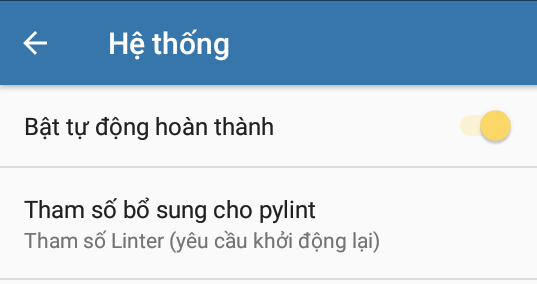

# Thông tin cần biết
## Pydroid 3
* **Pydroid 3** là môi trường phát triển tích hợp Python cho thiết bị di động Android, cho phép viết, chạy và sửa code Python trên điện thoại
* Vì tính miễn phí nên Pydroid 3 sẽ xuất hiện một số vẫn đề:
    * **Quảng cáo**: Phiên bản miễn phí xuất hiện quảng cáo, làm phiền và làm gián đoạn trải nghiệm người dùng
    * **Giới hạn tính năng**: Phiên bản miễn phí giới hạn tính năng so với phiên bản Premium, ảnh hưởng đến khả năng sử dụng và hiệu suất ứng dụng
## Pydroid 3 Premium APK
**Ở bản vá này tôi đã**
* **Việt hoá** *(Việt hoá lại giao diện)*
* Gỡ bỏ khả năng quảng cáo
* Khôi phục một số pip cài tự động
* Khôi phục tính năng tự động hoàn thành
    * Bật trong Hệ thống

      
    * Hoạt động

      
* Khôi phục báo cáo lỗi
* Sửa lỗi bàn phím khi dùng Gboard
* Khôi phục và cập nhật lại mẫu
* **Cuối cùng** loại bỏ những thứ không cần thiết để cải thiện hiệu suất
## Về Pydroid 3 Plugin
Trên một số thiết bị sẽ không cài được nó trên Google Play, vì thế tôi đã tạo một bản sao apk và obb fix điều đó
# Download
[Phiên bản mới nhất](https://github.com/tduc-dev/pydroid3/releases/tag/v1.0)
