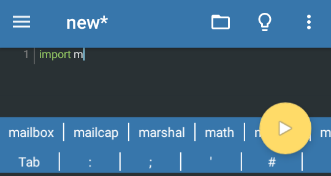
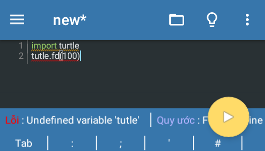
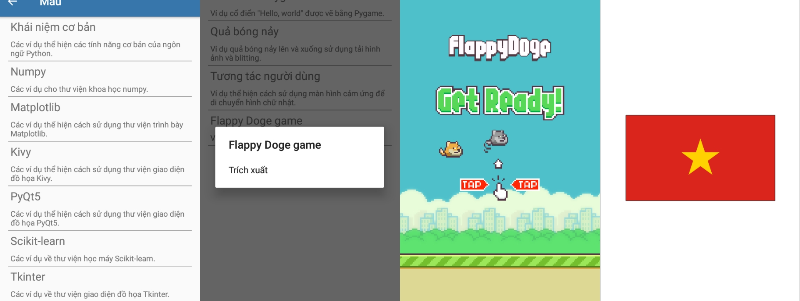
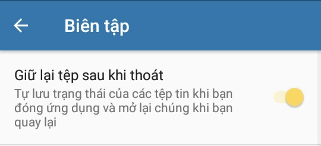
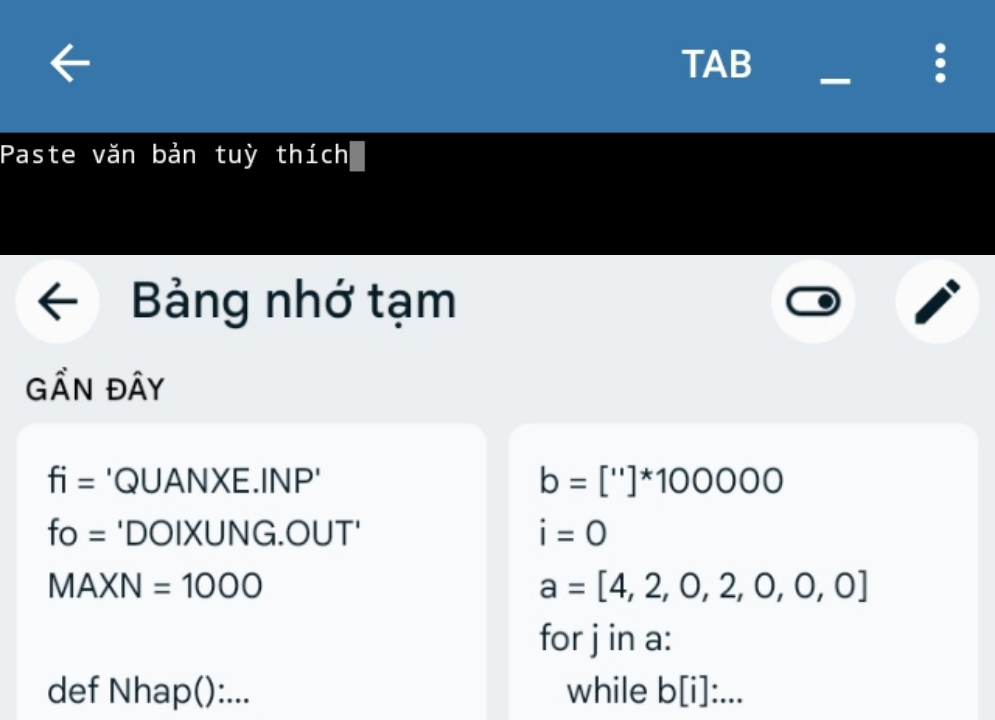

# Thông tin cần biết
## Pydroid 3
* **Pydroid 3** là môi trường phát triển tích hợp Python cho thiết bị di động Android, cho phép viết, chạy và sửa code Python trên điện thoại
* Vì tính miễn phí nên Pydroid 3 sẽ xuất hiện một số vẫn đề:
    * **Quảng cáo**: Phiên bản miễn phí xuất hiện quảng cáo, làm phiền và làm gián đoạn trải nghiệm người dùng
    * **Giới hạn tính năng**: Phiên bản miễn phí giới hạn tính năng so với phiên bản Premium, ảnh hưởng đến khả năng sử dụng và hiệu suất ứng dụng
## Pydroid 3 Premium APK
**Ở bản vá này mình đã**
* **Việt hoá** `(Việt hoá lại giao diện)`
* Gỡ bỏ khả năng quảng cáo
* Khôi phục một số pip cài tự động
* Khôi phục tính năng tự động hoàn thành
    * Từ giờ việc code sẽ trở nên nhẹ nhàng hơn với tính năng này

      
* Khôi phục phân tích mã
    * Từ giờ việc kiểm soát lỗi sai sẽ trở nên dễ dàng hơn
      
      
* Sửa lỗi bàn phím
* Khôi phục và cập nhật lại mẫu
    * Vô vàn mẫu siêu hay
      
      
* Tự động lưu trữ file khi thoát
    * Từ giờ không lo đang code thì bị văng :)
      
      
* Cập nhật 16/12/2023
    * Tính năng đề xuất bộ nhớ đệm văn bản để thuận tiện paste
      
      

    * Giao diện Solarized dark sẽ là mặc định
* **Cuối cùng** loại bỏ những thứ không cần thiết để cải thiện hiệu suất
## Về Pydroid 3 Plugin
Trên một số thiết bị sẽ không cài được nó trên Google Play, vì thế mình đã tạo một bản sao apk và obb fix điều đó
# Download

